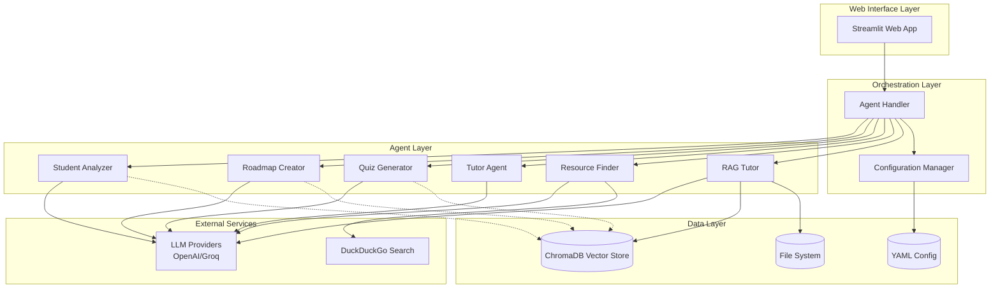

# Design Document: Multi-Agent AI Study Assistant

## Overview

The Multi-Agent AI Study Assistant is a sophisticated educational platform that orchestrates multiple specialized AI agents to deliver personalized learning experiences. The system employs a microservices-inspired agent architecture where each agent has a specific educational responsibility, coordinated through a central orchestration layer.

The platform leverages modern AI technologies including large language models, vector databases, and retrieval-augmented generation (RAG) to create an adaptive learning environment that responds to individual student needs and learning patterns.

## Architecture

### High-Level Architecture



### Agent Architecture Pattern

The system follows a **Specialized Agent Pattern** where each agent has:
- **Single Responsibility**: Each agent handles one specific educational function
- **Shared Context**: All agents access the same student learning profile
- **Loose Coupling**: Agents communicate through the orchestration layer
- **Stateless Design**: Agents don't maintain internal state between requests

## Components and Interfaces

### 1. Web Interface Layer

**Streamlit Application (app.py)**
- Provides responsive web interface for student interactions
- Handles file uploads for study documents
- Manages session state and user authentication
- Renders agent responses with appropriate formatting

```python
interface WebInterface {
    display_dashboard(student_profile: LearningProfile) -> None
    handle_file_upload(files: List[File]) -> UploadResult
    render_agent_response(response: AgentResponse) -> None
    manage_session_state() -> SessionState
}
```

### 2. Orchestration Layer

**Agent Handler (agent_handler.py)**
- Coordinates communication between agents
- Manages agent lifecycle and error handling
- Maintains student context across agent interactions
- Implements request routing and response aggregation

```python
interface AgentHandler {
    route_request(request: StudentRequest) -> AgentResponse
    coordinate_agents(multi_agent_task: Task) -> CoordinatedResponse
    handle_agent_failure(agent: Agent, error: Error) -> FallbackResponse
    maintain_context(student_id: str, context: Context) -> None
}
```

**Configuration Manager (config.py)**
- Loads and validates YAML configuration files
- Manages LLM provider settings and API keys
- Handles agent persona and prompt customization
- Provides runtime configuration updates

```python
interface ConfigurationManager {
    load_config(config_path: str) -> Configuration
    validate_config(config: Configuration) -> ValidationResult
    update_agent_prompts(agent_id: str, prompts: Dict) -> None
    switch_llm_provider(provider: LLMProvider) -> None
}
```

### 3. Specialized Agent Layer

**Student Analyzer Agent**
- Analyzes learning patterns and preferences
- Creates and updates learning profiles
- Identifies learning strengths and weaknesses
- Tracks progress over time

```python
interface StudentAnalyzer {
    analyze_learning_style(responses: List[Response]) -> LearningStyle
    create_profile(student_data: StudentData) -> LearningProfile
    update_profile(profile: LearningProfile, new_data: Data) -> LearningProfile
    identify_knowledge_gaps(assessment_results: Results) -> List[Gap]
}
```

**Roadmap Creator Agent**
- Generates personalized learning paths
- Creates structured topic sequences
- Recommends resources and milestones
- Adapts roadmaps based on progress

```python
interface RoadmapCreator {
    generate_roadmap(subject: str, profile: LearningProfile) -> LearningRoadmap
    adapt_roadmap(roadmap: LearningRoadmap, progress: Progress) -> LearningRoadmap
    recommend_resources(topic: str, learning_style: LearningStyle) -> List[Resource]
    set_milestones(roadmap: LearningRoadmap) -> List[Milestone]
}
```

**Quiz Generator Agent**
- Creates adaptive assessments
- Adjusts difficulty based on performance
- Provides immediate feedback
- Tracks assessment history

```python
interface QuizGenerator {
    generate_quiz(topic: str, difficulty: Difficulty, profile: LearningProfile) -> Quiz
    adapt_difficulty(current_performance: Performance) -> Difficulty
    provide_feedback(answer: Answer, correct: Answer) -> Feedback
    track_performance(quiz_results: Results) -> PerformanceMetrics
}
```

**Tutor Agent**
- Provides personalized explanations
- Adapts teaching style to learning preferences
- Breaks down complex concepts
- Offers alternative explanations

```python
interface TutorAgent {
    explain_concept(concept: str, profile: LearningProfile) -> Explanation
    adapt_teaching_style(style: LearningStyle) -> TeachingApproach
    break_down_concept(complex_concept: str) -> List[SimpleStep]
    provide_examples(concept: str, context: Context) -> List[Example]
}
```

**Resource Finder Agent**
- Discovers relevant learning materials
- Integrates with external search services
- Validates resource quality
- Personalizes recommendations

```python
interface ResourceFinder {
    find_resources(topic: str, resource_type: ResourceType) -> List[Resource]
    validate_resource_quality(resource: Resource) -> QualityScore
    personalize_recommendations(resources: List[Resource], profile: LearningProfile) -> List[Resource]
    search_external(query: str) -> List[ExternalResource]
}
```

**RAG Tutor Agent**
- Processes uploaded study documents
- Performs semantic search on document content
- Provides document-based answers
- Maintains document organization

```python
interface RAGTutor {
    process_document(document: Document) -> ProcessingResult
    semantic_search(query: str, documents: List[Document]) -> List[Chunk]
    answer_from_documents(question: str, context: List[Chunk]) -> Answer
    organize_documents(documents: List[Document]) -> DocumentStructure
}
```

### 4. Data Layer

**ChromaDB Vector Database**
- Stores document embeddings for semantic search
- Maintains learning profile vectors
- Supports similarity search and retrieval
- Handles vector indexing and optimization

**File System Storage**
- Stores uploaded study documents
- Maintains configuration files
- Handles temporary processing files
- Implements secure file access controls

## Data Models

### Core Data Structures

```python
@dataclass
class LearningProfile:
    student_id: str
    learning_style: LearningStyle
    strengths: List[str]
    weaknesses: List[str]
    preferences: Dict[str, Any]
    progress_history: List[ProgressEntry]
    created_at: datetime
    updated_at: datetime

@dataclass
class LearningRoadmap:
    roadmap_id: str
    student_id: str
    subject: str
    topics: List[Topic]
    milestones: List[Milestone]
    estimated_duration: timedelta
    resources: List[Resource]
    progress: float

@dataclass
class Quiz:
    quiz_id: str
    topic: str
    questions: List[Question]
    difficulty_level: Difficulty
    adaptive_settings: AdaptiveSettings
    time_limit: Optional[timedelta]

@dataclass
class StudyDocument:
    document_id: str
    filename: str
    content: str
    embeddings: List[float]
    metadata: Dict[str, Any]
    processed_at: datetime

@dataclass
class AgentResponse:
    agent_id: str
    response_type: ResponseType
    content: str
    metadata: Dict[str, Any]
    confidence_score: float
    timestamp: datetime
```

### Database Schema

**Vector Store Collections:**
- `documents`: Study document embeddings and metadata
- `learning_profiles`: Student profile vectors for similarity matching
- `quiz_performance`: Assessment result embeddings for pattern analysis

**File System Structure:**
```
data/
├── documents/
│   ├── student_uploads/
│   └── processed/
├── profiles/
│   └── learning_profiles.json
├── config/
│   ├── prompts.yaml
│   └── settings.yaml
└── temp/
    └── processing/
```

## Correctness Properties

*A property is a characteristic or behavior that should hold true across all valid executions of a system—essentially, a formal statement about what the system should do. Properties serve as the bridge between human-readable specifications and machine-verifiable correctness guarantees.*

Now I need to analyze the acceptance criteria to determine which ones can be tested as properties.

### Property 1: Learning Profile Creation and Persistence
*For any* valid student preference data and background information, the Student_Analyzer should create a comprehensive Learning_Profile that can be stored and retrieved across sessions
**Validates: Requirements 1.1, 1.4, 10.1**

### Property 2: Learning Style Detection
*For any* student responses and learning history, the Student_Analyzer should identify learning strengths, weaknesses, and preferred modalities (visual, auditory, kinesthetic, reading/writing)
**Validates: Requirements 1.2, 1.3**

### Property 3: Profile History Preservation
*For any* Learning_Profile updates, the system should maintain historical analysis data for progress tracking
**Validates: Requirements 1.5**

### Property 4: Personalized Roadmap Generation
*For any* subject, learning objectives, and Learning_Profile, the Roadmap_Creator should generate a structured Learning_Roadmap that incorporates the student's preferences and includes topics, milestones, timeframes, and resources
**Validates: Requirements 2.1, 2.2, 2.3, 2.4**

### Property 5: Roadmap Adaptability
*For any* Learning_Roadmap and student progress data, the system should be able to modify the roadmap based on feedback and progress updates
**Validates: Requirements 2.5**

### Property 6: Adaptive Quiz Generation
*For any* topic and student profile, the Quiz_Generator should create an Adaptive_Quiz with appropriate initial difficulty that adjusts based on student performance (increasing difficulty for correct answers, decreasing for struggles)
**Validates: Requirements 3.1, 3.2, 3.3**

### Property 7: Quiz Feedback Completeness
*For any* quiz answer, the system should provide immediate feedback, explanations, and update the student's Learning_Profile with performance data
**Validates: Requirements 3.4, 3.5**

### Property 8: Personalized Tutoring
*For any* student question and Learning_Profile, the Tutor_Agent should provide explanations tailored to the student's learning modality and break down complex concepts into manageable steps
**Validates: Requirements 4.1, 4.2, 4.3**

### Property 9: Tutoring Adaptability
*For any* tutoring interaction, the system should provide alternative explanations when additional help is needed and track all interactions for improvement
**Validates: Requirements 4.4, 4.5**

### Property 10: Document Processing and Storage
*For any* uploaded study document in supported formats (PDF, text, academic formats), the RAG_Tutor should process, store in the Vector_Database, and maintain organization and searchability
**Validates: Requirements 5.1, 5.2, 5.5**

### Property 11: Document-Based Q&A
*For any* question about uploaded documents, the RAG_Tutor should retrieve relevant information, provide accurate answers, and cite specific document sections
**Validates: Requirements 5.3, 5.4**

### Property 12: Resource Discovery and Personalization
*For any* topic and Learning_Profile, the Resource_Finder should search external services, recommend diverse and relevant materials, validate quality, and personalize recommendations based on student preferences
**Validates: Requirements 6.1, 6.2, 6.3, 6.4, 6.5**

### Property 13: Multi-Agent Coordination
*For any* multi-agent task, the Study_Assistant should coordinate communication between agents, maintain consistent student context, ensure response coherence, and facilitate secure data exchange
**Validates: Requirements 7.1, 7.2, 7.3, 7.4**

### Property 14: Graceful Failure Handling
*For any* agent failure scenario, the Study_Assistant should handle failures gracefully without disrupting the user experience
**Validates: Requirements 7.5**

### Property 15: Web Interface Responsiveness
*For any* standard browser and device, the Study_Assistant should provide a responsive interface with personalized dashboards, file upload support, clear content organization, and session state persistence
**Validates: Requirements 8.1, 8.2, 8.3, 8.4, 8.5**

### Property 16: Configuration Management
*For any* YAML configuration changes, the system should support agent behavior and prompt customization, apply changes without restart, support multiple LLM providers, and provide clear error messages with fallbacks
**Validates: Requirements 9.1, 9.2, 9.3, 9.4, 9.5**

### Property 17: Data Security and Privacy
*For any* sensitive student data, the system should maintain secure access controls, provide export functionality, implement retention policies, and comply with educational data privacy standards
**Validates: Requirements 10.2, 10.3, 10.4, 10.5**

## Error Handling

### Agent-Level Error Handling

**LLM Provider Failures:**
- Implement automatic fallback between OpenAI and Groq providers
- Cache recent responses to provide degraded service during outages
- Provide clear error messages when all providers are unavailable

**Agent Communication Failures:**
- Implement retry logic with exponential backoff
- Maintain agent health monitoring and automatic recovery
- Provide fallback responses when specific agents are unavailable

**Data Processing Errors:**
- Validate all input data before processing
- Implement graceful degradation for unsupported file formats
- Provide detailed error messages for document processing failures

### System-Level Error Handling

**Database Connection Issues:**
- Implement connection pooling and automatic reconnection
- Provide local caching for critical data during outages
- Maintain data consistency through transaction management

**Configuration Errors:**
- Validate YAML configuration on startup and updates
- Provide schema validation with detailed error messages
- Implement safe fallback to default configurations

**Resource Exhaustion:**
- Monitor system resources and implement rate limiting
- Provide queue management for high-load scenarios
- Implement graceful degradation when resources are limited

## Testing Strategy

### Dual Testing Approach

The Multi-Agent AI Study Assistant requires both **unit testing** and **property-based testing** for comprehensive coverage:

**Unit Tests:**
- Test specific agent behaviors with known inputs and expected outputs
- Validate integration points between agents and external services
- Test error conditions and edge cases for each component
- Verify configuration loading and validation logic
- Test file upload and document processing workflows

**Property-Based Tests:**
- Verify universal properties across all possible inputs using randomized test data
- Test agent coordination and consistency across multiple interaction scenarios
- Validate data persistence and retrieval across different student profiles
- Test adaptive behaviors with varying student performance patterns
- Verify security and privacy compliance across all data handling scenarios

### Property-Based Testing Configuration

**Testing Framework:** Use Hypothesis (Python) for property-based testing
**Test Configuration:**
- Minimum 100 iterations per property test to ensure comprehensive coverage
- Each property test must reference its corresponding design document property
- Tag format: **Feature: multi-agent-study-assistant, Property {number}: {property_text}**

**Example Property Test Structure:**
```python
@given(student_data=student_data_strategy())
def test_learning_profile_creation_and_persistence(student_data):
    """
    Feature: multi-agent-study-assistant, Property 1: Learning Profile Creation and Persistence
    """
    # Test implementation
    profile = student_analyzer.create_profile(student_data)
    assert profile is not None
    assert profile.can_be_persisted()
    # Additional assertions...
```

### Integration Testing

**Multi-Agent Workflow Tests:**
- Test complete learning scenarios from profile creation to assessment
- Verify data flow between all agents in realistic usage patterns
- Test system behavior under concurrent user loads
- Validate end-to-end document processing and Q&A workflows

**External Service Integration:**
- Test LLM provider switching and fallback mechanisms
- Verify external search service integration and error handling
- Test vector database operations under various load conditions
- Validate file system operations and security controls

### Performance Testing

**Load Testing:**
- Test system performance with multiple concurrent users
- Verify response times for agent interactions under load
- Test vector database query performance with large document collections
- Validate memory usage and resource management

**Scalability Testing:**
- Test system behavior with large numbers of learning profiles
- Verify performance with extensive document collections
- Test agent coordination efficiency with multiple simultaneous requests
- Validate configuration management with complex setups