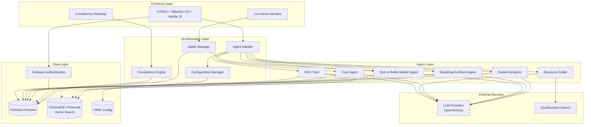

# Design Document: Multi-Agent AI Study Assistant

## Overview

The Multi-Agent AI Study Assistant is an **Autonomous Social Learning Ecosystem** that orchestrates multiple specialized AI agents to deliver personalized, competitive, and gamified learning experiences. The system employs a microservices-inspired agent architecture where each agent has a specific educational responsibility, coordinated through a central orchestration layer.

The platform leverages modern AI technologies including large language models, scalable vector databases, and retrieval-augmented generation (RAG) to create an adaptive learning environment that responds to individual student needs, learning patterns, and competitive motivations. The system introduces social competitive layers through real-time quiz battles, gamified retention mechanisms with visual progress tracking, and multi-roadmap management for complex learning journeys.

**Core Innovation:** This is not a simple study tool—it's a comprehensive learning platform that combines AI-powered personalization with social competition and gamification to maximize engagement, retention, and learning outcomes.

## Architecture

### High-Level Architecture



### Agent Architecture Pattern

The system follows a **Specialized Agent Pattern** with **Social Competitive Extensions** where each agent has:
- **Single Responsibility**: Each agent handles one specific educational function
- **Shared Context**: All agents access the same student learning profile via Firebase Firestore
- **Loose Coupling**: Agents communicate through the orchestration layer
- **Stateless Design**: Agents don't maintain internal state between requests
- **Real-Time Coordination**: Battle Manager coordinates synchronous multiplayer interactions
- **Gamification Integration**: Consistency Engine tracks and rewards learning streaks

## Components and Interfaces

### 1. Frontend Layer

**HTML5 + Tailwind CSS + Vanilla JS Application**
- Provides responsive, modern web interface for student interactions
- Implements real-time battle arena with WebSocket connections
- Renders consistency heatmap with LeetCode-style contribution graph
- Manages authentication state through Firebase Auth
- Handles file uploads for study documents
- Provides multi-roadmap vault interface for switching between learning paths

```typescript
interface WebInterface {
    displayDashboard(studentProfile: LearningProfile): void
    handleFileUpload(files: File[]): Promise<UploadResult>
    renderAgentResponse(response: AgentResponse): void
    manageAuthState(): AuthState
    displayBattleArena(battleSession: BattleSession): void
    renderConsistencyHeatmap(streakData: StreakData): void
    switchRoadmap(roadmapId: string): void
}
```

**1v1 Arena Interface**
- Real-time quiz battle interface with live score updates
- Friend challenge system with invite links
- Battle history and leaderboard displays
- Spectator mode for ongoing battles

```typescript
interface ArenaInterface {
    initiateBattle(opponentId: string, topics: string[]): BattleSession
    displayLiveScores(battleId: string): void
    renderBattleQuestion(question: Question, timeRemaining: number): void
    showBattleResults(results: BattleResults): void
}
```

**Consistency Heatmap**
- LeetCode-style contribution graph showing daily learning activity
- Streak counter with visual indicators
- XP progression bar and level display
- Achievement badges and milestones

```typescript
interface ConsistencyHeatmap {
    renderHeatmap(userId: string, dateRange: DateRange): void
    displayStreakCount(currentStreak: number, longestStreak: number): void
    showXPProgress(currentXP: number, nextLevelXP: number): void
    highlightAchievements(achievements: Achievement[]): void
}
```

### 2. Orchestration Layer

**Agent Handler (agent_handler.py)**
- Coordinates communication between agents
- Manages agent lifecycle and error handling
- Maintains student context across agent interactions via Firestore
- Implements request routing and response aggregation
- Enforces data isolation boundaries per user_id

```python
interface AgentHandler {
    route_request(request: StudentRequest) -> AgentResponse
    coordinate_agents(multi_agent_task: Task) -> CoordinatedResponse
    handle_agent_failure(agent: Agent, error: Error) -> FallbackResponse
    maintain_context(student_id: str, context: Context) -> None
    enforce_data_isolation(user_id: str, query: Query) -> IsolatedQuery
}
```

**Configuration Manager (config.py)**
- Loads and validates YAML configuration files
- Manages LLM provider settings and API keys
- Handles agent persona and prompt customization
- Provides runtime configuration updates
- Manages Firebase credentials and connection settings

```python
interface ConfigurationManager {
    load_config(config_path: str) -> Configuration
    validate_config(config: Configuration) -> ValidationResult
    update_agent_prompts(agent_id: str, prompts: Dict) -> None
    switch_llm_provider(provider: LLMProvider) -> None
    configure_firebase(credentials: FirebaseCredentials) -> None
}
```

**Battle Manager (battle_manager.py)**
- Coordinates real-time quiz battles between users
- Manages battle sessions and state synchronization
- Generates fair questions from topic intersection
- Tracks live scores and determines winners
- Handles battle invitations and matchmaking

```python
interface BattleManager {
    create_battle(user1_id: str, user2_id: str, topics: List[str]) -> BattleSession
    get_topic_intersection(user1_topics: Set[str], user2_topics: Set[str]) -> Set[str]
    generate_battle_questions(topics: Set[str], count: int) -> List[Question]
    update_battle_score(battle_id: str, user_id: str, points: int) -> BattleState
    finalize_battle(battle_id: str) -> BattleResults
    send_battle_invitation(from_user: str, to_user: str, topics: List[str]) -> Invitation
}
```

**Consistency Engine (consistency_engine.py)**
- Tracks daily learning activity and streaks
- Updates contribution heatmap data
- Calculates XP and level progression
- Awards achievements and badges
- Sends streak reminder notifications

```python
interface ConsistencyEngine {
    record_activity(user_id: str, activity_type: ActivityType, timestamp: datetime) -> None
    update_streak(user_id: str) -> StreakData
    calculate_xp_gain(activity: Activity) -> int
    award_xp(user_id: str, xp_amount: int) -> XPUpdate
    check_achievements(user_id: str) -> List[Achievement]
    generate_heatmap_data(user_id: str, date_range: DateRange) -> HeatmapData
}
```

### 3. Specialized Agent Layer

**Student Analyzer Agent**
- Analyzes learning patterns and preferences
- Creates and updates learning profiles in Firestore
- Identifies learning strengths and weaknesses
- Tracks progress over time with XP and streak integration

```python
interface StudentAnalyzer {
    analyze_learning_style(responses: List[Response]) -> LearningStyle
    create_profile(student_data: StudentData) -> LearningProfile
    update_profile(profile: LearningProfile, new_data: Data) -> LearningProfile
    identify_knowledge_gaps(assessment_results: Results) -> List[Gap]
    sync_to_firestore(profile: LearningProfile) -> FirestoreDocument
}
```

**Roadmap Architect Agent**
- Generates personalized learning paths
- Creates structured topic sequences
- Recommends resources and milestones
- Adapts roadmaps based on progress
- **NEW:** Manages multiple active roadmaps per user
- **NEW:** Supports roadmap switching and parallel learning paths

```python
interface RoadmapArchitect {
    generate_roadmap(subject: str, profile: LearningProfile) -> LearningRoadmap
    adapt_roadmap(roadmap: LearningRoadmap, progress: Progress) -> LearningRoadmap
    recommend_resources(topic: str, learning_style: LearningStyle) -> List[Resource]
    set_milestones(roadmap: LearningRoadmap) -> List[Milestone]
    create_roadmap_vault(user_id: str) -> RoadmapVault
    save_roadmap(user_id: str, roadmap: LearningRoadmap) -> str
    list_user_roadmaps(user_id: str) -> List[RoadmapSummary]
    switch_active_roadmap(user_id: str, roadmap_id: str) -> LearningRoadmap
    archive_roadmap(user_id: str, roadmap_id: str) -> None
}
```

**Quiz & Battle Master Agent**
- Creates adaptive assessments for solo practice
- **NEW:** Generates fair battle questions from topic intersection
- Adjusts difficulty based on performance
- Provides immediate feedback
- Tracks assessment history and battle statistics
- **NEW:** Ensures battle fairness by only using mutually completed topics

```python
interface QuizBattleMaster {
    generate_quiz(topic: str, difficulty: Difficulty, profile: LearningProfile) -> Quiz
    generate_battle_quiz(topics: Set[str], user1_profile: LearningProfile, user2_profile: LearningProfile) -> BattleQuiz
    ensure_topic_intersection(user1_topics: Set[str], user2_topics: Set[str]) -> Set[str]
    adapt_difficulty(current_performance: Performance) -> Difficulty
    provide_feedback(answer: Answer, correct: Answer) -> Feedback
    track_performance(quiz_results: Results) -> PerformanceMetrics
    record_battle_result(battle_id: str, winner_id: str, loser_id: str) -> None
}
```

**Tutor Agent**
- Provides personalized explanations
- Adapts teaching style to learning preferences
- Breaks down complex concepts
- Offers alternative explanations
- Integrates with consistency tracking for engagement rewards

```python
interface TutorAgent {
    explain_concept(concept: str, profile: LearningProfile) -> Explanation
    adapt_teaching_style(style: LearningStyle) -> TeachingApproach
    break_down_concept(complex_concept: str) -> List[SimpleStep]
    provide_examples(concept: str, context: Context) -> List[Example]
    record_tutoring_session(user_id: str, duration: timedelta) -> ActivityRecord
}
```

**Resource Finder Agent**
- Discovers relevant learning materials
- Integrates with external search services
- Validates resource quality
- Personalizes recommendations
- Stores resource metadata in Firestore

```python
interface ResourceFinder {
    find_resources(topic: str, resource_type: ResourceType) -> List[Resource]
    validate_resource_quality(resource: Resource) -> QualityScore
    personalize_recommendations(resources: List[Resource], profile: LearningProfile) -> List[Resource]
    search_external(query: str) -> List[ExternalResource]
    cache_resources_firestore(resources: List[Resource]) -> None
}
```

**RAG Tutor Agent**
- Processes uploaded study documents
- Performs semantic search on document content via ChromaDB/Pinecone
- Provides document-based answers
- Maintains document organization in Firestore
- **NEW:** Enforces strict user_id data isolation for RAG queries

```python
interface RAGTutor {
    process_document(document: Document, user_id: str) -> ProcessingResult
    semantic_search(query: str, user_id: str, documents: List[Document]) -> List[Chunk]
    answer_from_documents(question: str, context: List[Chunk], user_id: str) -> Answer
    organize_documents(documents: List[Document], user_id: str) -> DocumentStructure
    enforce_user_isolation(query: VectorQuery, user_id: str) -> IsolatedVectorQuery
}
```

### 4. Data Layer

**Firebase Firestore (NoSQL Database)**
- Stores user profiles with XP, streaks, and battle statistics
- Maintains learning roadmaps and progress data
- Stores battle sessions and real-time scores
- Handles document metadata and organization
- Provides real-time synchronization for battle updates
- Implements security rules for user data isolation

**Firebase Authentication**
- Manages user authentication and session tokens
- Provides OAuth integration (Google, GitHub, etc.)
- Enforces user identity for all data operations
- Generates secure user_id for data isolation

**ChromaDB / Pinecone (Scalable Vector Search)**
- Stores document embeddings for semantic search
- Maintains learning profile vectors
- Supports similarity search and retrieval at scale
- Handles vector indexing and optimization
- Enforces user_id filtering for isolated vector queries

**YAML Configuration Files**
- Stores agent prompts and behavior settings
- Manages LLM provider configurations
- Defines gamification rules and XP calculations
- Configures battle parameters and fairness rules

## Data Models

### Core Data Structures

```python
@dataclass
class LearningProfile:
    student_id: str
    learning_style: LearningStyle
    strengths: List[str]
    weaknesses: List[str]
    preferences: Dict[str, Any]
    progress_history: List[ProgressEntry]
    streak_count: int  # NEW: Current learning streak
    battles_won: int  # NEW: Total battle victories
    xp: int  # NEW: Experience points for gamification
    level: int  # NEW: Calculated from XP
    created_at: datetime
    updated_at: datetime

@dataclass
class LearningRoadmap:
    roadmap_id: str
    student_id: str
    subject: str
    topics: List[Topic]
    milestones: List[Milestone]
    estimated_duration: timedelta
    resources: List[Resource]
    progress: float
    is_active: bool  # NEW: Whether this is the currently active roadmap
    created_at: datetime
    last_accessed: datetime

@dataclass
class RoadmapVault:
    user_id: str
    active_roadmap_id: Optional[str]
    roadmaps: List[LearningRoadmap]
    archived_roadmaps: List[str]

@dataclass
class Quiz:
    quiz_id: str
    topic: str
    questions: List[Question]
    difficulty_level: Difficulty
    adaptive_settings: AdaptiveSettings
    time_limit: Optional[timedelta]
    user_id: str

@dataclass
class BattleSession:
    battle_id: str
    user1_id: str
    user2_id: str
    topic_intersection: Set[str]
    questions: List[Question]
    user1_score: int
    user2_score: int
    current_question_index: int
    status: BattleStatus  # WAITING, IN_PROGRESS, COMPLETED
    winner_id: Optional[str]
    started_at: datetime
    completed_at: Optional[datetime]

@dataclass
class StreakData:
    user_id: str
    current_streak: int
    longest_streak: int
    last_activity_date: date
    activity_calendar: Dict[date, int]  # Date -> activity count
    total_active_days: int

@dataclass
class StudyDocument:
    document_id: str
    user_id: str  # NEW: Enforce data isolation
    filename: str
    content: str
    embeddings: List[float]
    metadata: Dict[str, Any]
    processed_at: datetime

@dataclass
class AgentResponse:
    agent_id: str
    response_type: ResponseType
    content: str
    metadata: Dict[str, Any]
    confidence_score: float
    timestamp: datetime
```

### Firestore Collections Schema

**Collections:**
- `users`: User profiles with authentication data, XP, streaks, and battle stats
- `learning_profiles`: Detailed learning profiles linked to user_id
- `roadmaps`: Learning roadmaps with active/archived status
- `battle_sessions`: Real-time battle data with live scores
- `documents`: Study document metadata (content stored in vector DB)
- `streak_data`: Daily activity tracking and heatmap data
- `achievements`: Unlocked badges and milestones

**Security Rules:**
- All queries must filter by authenticated user_id
- Battle sessions readable by both participants
- Documents strictly isolated per user_id
- Streak data writable only by Consistency Engine

**Vector Store Collections:**
- `user_documents_{user_id}`: Per-user document embeddings (isolated)
- `learning_profiles`: Student profile vectors for similarity matching
- `quiz_performance`: Assessment result embeddings for pattern analysis

## Correctness Properties

*A property is a characteristic or behavior that should hold true across all valid executions of a system—essentially, a formal statement about what the system should do. Properties serve as the bridge between human-readable specifications and machine-verifiable correctness guarantees.*

### Property 1: Learning Profile Creation and Persistence
*For any* valid student preference data and background information, the Student_Analyzer should create a comprehensive Learning_Profile that can be stored in Firestore and retrieved across sessions with all gamification fields (streak_count, battles_won, xp) initialized
**Validates: Requirements 1.1, 1.4, 10.1**

### Property 2: Learning Style Detection
*For any* student responses and learning history, the Student_Analyzer should identify learning strengths, weaknesses, and preferred modalities (visual, auditory, kinesthetic, reading/writing)
**Validates: Requirements 1.2, 1.3**

### Property 3: Profile History Preservation
*For any* Learning_Profile updates, the system should maintain historical analysis data for progress tracking while correctly incrementing XP and streak counters
**Validates: Requirements 1.5**

### Property 4: Personalized Roadmap Generation
*For any* subject, learning objectives, and Learning_Profile, the Roadmap_Architect should generate a structured Learning_Roadmap that incorporates the student's preferences and includes topics, milestones, timeframes, and resources
**Validates: Requirements 2.1, 2.2, 2.3, 2.4**

### Property 5: Roadmap Adaptability
*For any* Learning_Roadmap and student progress data, the system should be able to modify the roadmap based on feedback and progress updates
**Validates: Requirements 2.5**

### Property 6: Multi-Roadmap Vault Management
*For any* user with multiple learning roadmaps, the Roadmap_Architect should maintain a RoadmapVault that allows saving, listing, switching between, and archiving roadmaps without data loss
**Validates: Requirements 2.6**

### Property 7: Adaptive Quiz Generation
*For any* topic and student profile, the Quiz_Battle_Master should create an Adaptive_Quiz with appropriate initial difficulty that adjusts based on student performance (increasing difficulty for correct answers, decreasing for struggles)
**Validates: Requirements 3.1, 3.2, 3.3**

### Property 8: Quiz Feedback Completeness
*For any* quiz answer, the system should provide immediate feedback, explanations, and update the student's Learning_Profile with performance data
**Validates: Requirements 3.4, 3.5**

### Property 9: Battle Fairness - Topic Intersection
*For any* two users in a battle, the Quiz_Battle_Master must generate questions exclusively from the intersection of both users' completed topics, ensuring neither user faces unfamiliar material
**Validates: Requirements 3.6, 11.1**

### Property 10: Battle Session Integrity
*For any* active BattleSession, the Battle_Manager must maintain real-time score synchronization, prevent cheating through timestamp validation, and correctly determine the winner based on final scores
**Validates: Requirements 11.2, 11.3**

### Property 11: Personalized Tutoring
*For any* student question and Learning_Profile, the Tutor_Agent should provide explanations tailored to the student's learning modality and break down complex concepts into manageable steps
**Validates: Requirements 4.1, 4.2, 4.3**

### Property 12: Tutoring Adaptability
*For any* tutoring interaction, the system should provide alternative explanations when additional help is needed and track all interactions for improvement
**Validates: Requirements 4.4, 4.5**

### Property 13: Document Processing and Storage
*For any* uploaded study document in supported formats (PDF, text, academic formats), the RAG_Tutor should process, store in the Vector_Database with user_id tagging, and maintain organization and searchability in Firestore
**Validates: Requirements 5.1, 5.2, 5.5**

### Property 14: Document-Based Q&A
*For any* question about uploaded documents, the RAG_Tutor should retrieve relevant information, provide accurate answers, and cite specific document sections
**Validates: Requirements 5.3, 5.4**

### Property 15: Data Isolation in RAG Queries
*For any* RAG query, the system must strictly filter vector search results by the authenticated user_id, ensuring users can only access their own uploaded documents
**Validates: Requirements 5.6, 10.2**

### Property 16: Resource Discovery and Personalization
*For any* topic and Learning_Profile, the Resource_Finder should search external services, recommend diverse and relevant materials, validate quality, and personalize recommendations based on student preferences
**Validates: Requirements 6.1, 6.2, 6.3, 6.4, 6.5**

### Property 17: Multi-Agent Coordination
*For any* multi-agent task, the Study_Assistant should coordinate communication between agents, maintain consistent student context via Firestore, ensure response coherence, and facilitate secure data exchange
**Validates: Requirements 7.1, 7.2, 7.3, 7.4**

### Property 18: Graceful Failure Handling
*For any* agent failure scenario, the Study_Assistant should handle failures gracefully without disrupting the user experience
**Validates: Requirements 7.5**

### Property 19: Web Interface Responsiveness
*For any* standard browser and device, the Study_Assistant should provide a responsive interface with personalized dashboards, file upload support, clear content organization, and authentication state persistence
**Validates: Requirements 8.1, 8.2, 8.3, 8.4, 8.5**

### Property 20: Consistency Tracking - Immediate Updates
*For any* learning activity (quiz completion, battle win, tutoring session), the Consistency_Engine must immediately update the user's streak count, XP, and heatmap data in Firestore
**Validates: Requirements 12.1, 12.2**

### Property 21: Streak Calculation Accuracy
*For any* user with daily activity records, the Consistency_Engine should correctly calculate current streak (consecutive days with activity) and longest streak, breaking streaks only when a full day is missed
**Validates: Requirements 12.3**

### Property 22: XP and Level Progression
*For any* XP gain event, the system should correctly increment the user's XP total and recalculate their level according to the defined XP thresholds
**Validates: Requirements 12.4**

### Property 23: Heatmap Data Integrity
*For any* date range query, the Consistency_Engine should generate accurate heatmap data showing activity counts per day without gaps or duplicates
**Validates: Requirements 12.5**

### Property 24: Configuration Management
*For any* YAML configuration changes, the system should support agent behavior and prompt customization, apply changes without restart, support multiple LLM providers, and provide clear error messages with fallbacks
**Validates: Requirements 9.1, 9.2, 9.3, 9.4, 9.5**

### Property 25: Data Security and Privacy
*For any* sensitive student data, the system should maintain secure access controls via Firebase Auth, provide export functionality, implement retention policies, and comply with educational data privacy standards
**Validates: Requirements 10.2, 10.3, 10.4, 10.5**

### Property 26: Battle Invitation and Matchmaking
*For any* battle invitation sent between users, the system should correctly deliver the invitation, allow acceptance/rejection, and initialize a BattleSession only when both users accept
**Validates: Requirements 11.4**

## Error Handling

### Agent-Level Error Handling

**LLM Provider Failures:**
- Implement automatic fallback between OpenAI and Groq providers
- Cache recent responses to provide degraded service during outages
- Provide clear error messages when all providers are unavailable

**Agent Communication Failures:**
- Implement retry logic with exponential backoff
- Maintain agent health monitoring and automatic recovery
- Provide fallback responses when specific agents are unavailable

**Data Processing Errors:**
- Validate all input data before processing
- Implement graceful degradation for unsupported file formats
- Provide detailed error messages for document processing failures

### System-Level Error Handling

**Firebase Connection Issues:**
- Implement connection pooling and automatic reconnection
- Provide local caching for critical data during outages
- Maintain data consistency through Firestore transactions
- Handle authentication token expiration gracefully

**Vector Database Connection Issues:**
- Implement retry logic for ChromaDB/Pinecone queries
- Provide fallback to cached embeddings when vector DB is unavailable
- Queue document processing jobs during outages

**Configuration Errors:**
- Validate YAML configuration on startup and updates
- Provide schema validation with detailed error messages
- Implement safe fallback to default configurations

**Resource Exhaustion:**
- Monitor system resources and implement rate limiting
- Provide queue management for high-load scenarios
- Implement graceful degradation when resources are limited

### Battle-Specific Error Handling

**Real-Time Synchronization Failures:**
- Implement WebSocket reconnection with state recovery
- Handle network interruptions during battles gracefully
- Provide battle pause/resume functionality for connection issues

**Battle Fairness Violations:**
- Validate topic intersection before battle start
- Reject battles with empty topic intersection
- Log and alert on any fairness rule violations

**Concurrent Battle Updates:**
- Use Firestore transactions for atomic score updates
- Implement optimistic locking for battle state changes
- Handle race conditions in simultaneous answer submissions

## Testing Strategy

### Dual Testing Approach

The Multi-Agent AI Study Assistant requires both **unit testing** and **property-based testing** for comprehensive coverage:

**Unit Tests:**
- Test specific agent behaviors with known inputs and expected outputs
- Validate integration points between agents and external services (Firebase, LLM providers)
- Test error conditions and edge cases for each component
- Verify configuration loading and validation logic
- Test file upload and document processing workflows
- Test battle session creation and score updates with specific scenarios
- Test consistency engine calculations with known activity patterns
- Verify roadmap vault operations (save, switch, archive)

**Property-Based Tests:**
- Verify universal properties across all possible inputs using randomized test data
- Test agent coordination and consistency across multiple interaction scenarios
- Validate data persistence and retrieval across different student profiles
- Test adaptive behaviors with varying student performance patterns
- Verify security and privacy compliance across all data handling scenarios
- **Test battle fairness with random user topic sets**
- **Test data isolation with random user_id combinations**
- **Test consistency tracking with random activity sequences**
- **Test multi-roadmap operations with random roadmap configurations**

### Property-Based Testing Configuration

**Testing Framework:** Use Hypothesis (Python) for property-based testing
**Test Configuration:**
- Minimum 100 iterations per property test to ensure comprehensive coverage
- Each property test must reference its corresponding design document property
- Tag format: **Feature: multi-agent-study-assistant, Property {number}: {property_text}**

**Example Property Test Structure:**
```python
@given(student_data=student_data_strategy())
def test_learning_profile_creation_and_persistence(student_data):
    """
    Feature: multi-agent-study-assistant, Property 1: Learning Profile Creation and Persistence
    """
    profile = student_analyzer.create_profile(student_data)
    assert profile is not None
    assert profile.streak_count == 0
    assert profile.battles_won == 0
    assert profile.xp == 0
    assert profile.can_be_persisted_to_firestore()

@given(user1_topics=st.sets(st.text()), user2_topics=st.sets(st.text()))
def test_battle_fairness_topic_intersection(user1_topics, user2_topics):
    """
    Feature: multi-agent-study-assistant, Property 9: Battle Fairness - Topic Intersection
    """
    battle_quiz = quiz_battle_master.generate_battle_quiz(user1_topics, user2_topics)
    intersection = user1_topics & user2_topics
    for question in battle_quiz.questions:
        assert question.topic in intersection

@given(user_id=st.text(), query=st.text(), other_user_id=st.text())
def test_data_isolation_in_rag_queries(user_id, query, other_user_id):
    """
    Feature: multi-agent-study-assistant, Property 15: Data Isolation in RAG Queries
    """
    assume(user_id != other_user_id)
    results = rag_tutor.semantic_search(query, user_id)
    for result in results:
        assert result.user_id == user_id
```

### Integration Testing

**Multi-Agent Workflow Tests:**
- Test complete learning scenarios from profile creation to assessment
- Verify data flow between all agents in realistic usage patterns via Firestore
- Test system behavior under concurrent user loads
- Validate end-to-end document processing and Q&A workflows
- **Test complete battle flow from invitation to winner determination**
- **Test consistency tracking across multiple days of activity**
- **Test roadmap switching without data loss**

**External Service Integration:**
- Test LLM provider switching and fallback mechanisms
- Verify external search service integration and error handling
- Test vector database operations under various load conditions
- **Test Firebase Authentication integration and token refresh**
- **Test Firestore security rules enforcement**
- **Test real-time synchronization for battle updates**

### Performance Testing

**Load Testing:**
- Test system performance with multiple concurrent users
- Verify response times for agent interactions under load
- Test vector database query performance with large document collections
- Validate memory usage and resource management
- **Test real-time battle performance with concurrent battles**
- **Test Firestore read/write throughput under load**

**Scalability Testing:**
- Test system behavior with large numbers of learning profiles
- Verify performance with extensive document collections
- Test agent coordination efficiency with multiple simultaneous requests
- Validate configuration management with complex setups
- **Test vector database scaling with per-user collections**
- **Test consistency engine performance with years of activity data**

### Security Testing

**Authentication and Authorization:**
- Test Firebase Auth integration and token validation
- Verify user_id enforcement across all data operations
- Test session management and token expiration handling

**Data Isolation:**
- Verify Firestore security rules prevent cross-user data access
- Test vector database queries enforce user_id filtering
- Validate battle sessions only accessible to participants

**Input Validation:**
- Test all user inputs for injection attacks
- Verify file upload validation and sanitization
- Test configuration input validation